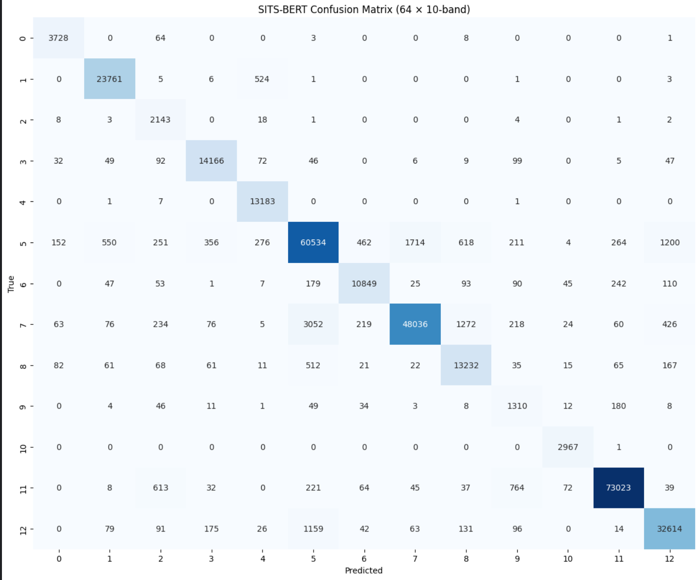
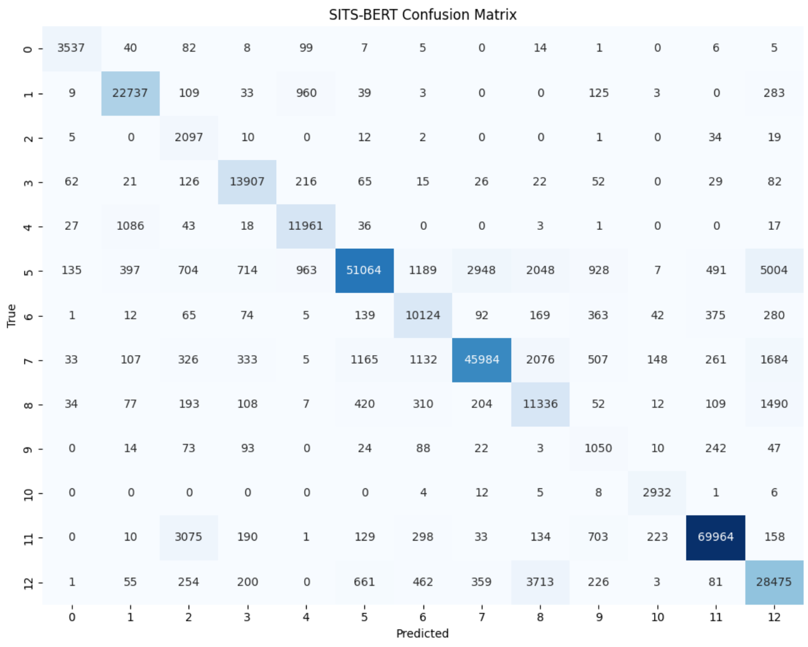
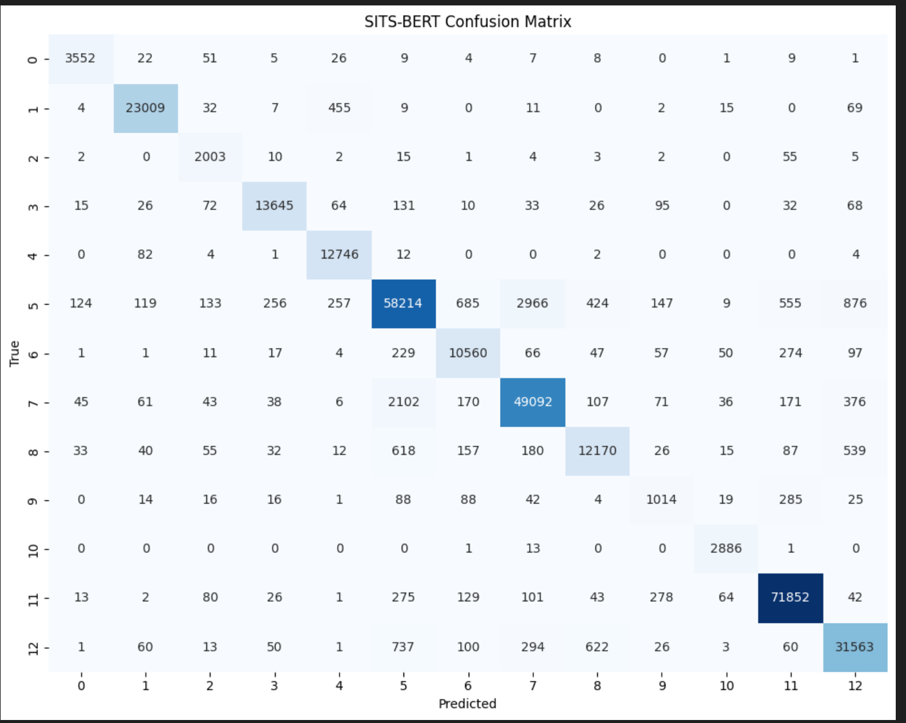

# Fine-Tuning SITS-BERT pour la cartographie des cultures en Californie
> *Self-Supervised Satellite Image Time-Series BERT – Project README*

## 🚀 Description du projet
Ce dépôt héberge l’ensemble des notebooks et scripts nécessaires pour :

1. **Pré-entraîner** le modèle **SITS-BERT** sur le jeu de données **TimeSen2Crop** ;  
2. **Affiner (fine-tune)** ce modèle sur le jeu de données **California Labeled** (Cropland Data Layer 2019) ;  
3. Évaluer différentes variantes (10 bandes, 6 bandes, 6 bandes + augmentation) et comparer les performances obtenues.

Le code d’origine de SITS-BERT est disponible sur [linlei1214/SITS-BERT](https://github.com/linlei1214/SITS-BERT).

---

## 🧠 Présentation rapide de SITS-BERT
*SITS-BERT* est un **Transformeur bi-directionnel** auto-supervisé, inspiré de BERT, conçu pour l’analyse de **séries temporelles d’images satellite (SITS)**.  
Le pré-texte d’apprentissage consiste à **masquer aléatoirement des observations** dans la série temporelle et à demander au réseau de les reconstruire, ce qui force le modèle à capturer des représentations **spatio-spectro-temporelles** riches et transférables.  
Une fois pré-entraîné, le réseau se **fine-tune** efficacement sur des tâches de classification disposant de peu de données labellisées.

---

## 📂 Arborescence du dépôt
| Notebook / Script | Rôle |
|-------------------|------|
| `sits-bert-pretrain-dataprep.ipynb` | Préparation du jeu **TimeSen2Crop** (normalisation, splits, etc.) |
| `sits-bert-pretrain-model.ipynb` | Pré-entraînement de SITS-BERT sur **TimeSen2Crop** |
| `sits-bert-ts2c-finetune+Eval-6.ipynb` | Fine-tune sur **California Labeled** – **6 bandes** |
| `sits-bert-finetune-eval-10.ipynb` | Reproduction de l’entraînement **10 bandes** décrit dans l’article original |
| `sits-bert-finetune-eval-6-augmented.ipynb` | Fine-tune **6 bandes + augmentation de données** |

> **Remarque :** chaque notebook peut être exécuté indépendamment ; assure-toi simplement d’adapter les chemins vers les jeux de données.

---

## 📊 Jeux de données

### 1. TimeSen2Crop (pré-entraînement)
* Plus d’un **million** de séries temporelles Sentinel-2 (Sept 2017 → Août 2018).  
* **16 cultures** annotées au pixel.  
* Résolution : 10 m, bandes spectrales corrigées atmosphériquement.  

### 2. California Labeled (fine-tuning)
* Extrait du **Cropland Data Layer 2019** centré sur la vallée centrale (tuiles T10SEJ, T10SFH, T11SKA).  
* **13 classes** (10 cultures majeures + 3 classes non agricoles).  
* 45 images Sentinel-2 sur l’année 2019.

---

## ✅ Résultats

* **Modèle papier (10 bandes)**  
  * Overall Accuracy : **94.18 %**  
  * Kappa : **93.2 %**  
  * Average Accuracy : **95.3 %**  
  

* **Modèle 6 bandes**  
  * Overall Accuracy : **86.57 %**  
  * Kappa : **84.3 %**  
  * Average Accuracy : **87.3 %**  
  

* **Modèle 6 bandes + augmentation**  
  * Overall Accuracy : **94.34 %**  
  * Kappa : **93.3 %**  
  * Average Accuracy : **92.4 %**  
  

